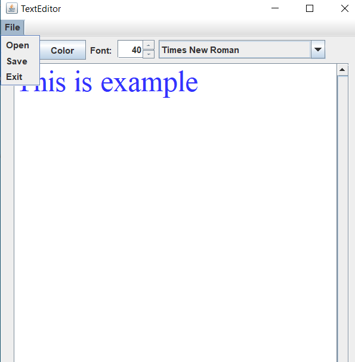

# Text Editor

It is an Editor application developed using Java Swing. In this application you can open, save and close the file. You can write whatever you want in the Editor, change the color of the text, change the font settings of the text, and also change the size of the text.

## Contributing
Pull requests are welcome. For major changes, please open an issue first to discuss what you would like to change.

Please make sure to update tests as appropriate.

## License
[MIT](https://choosealicense.com/licenses/mit/)